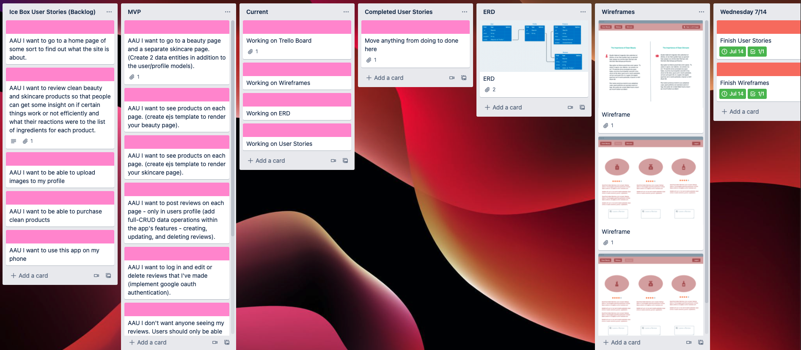
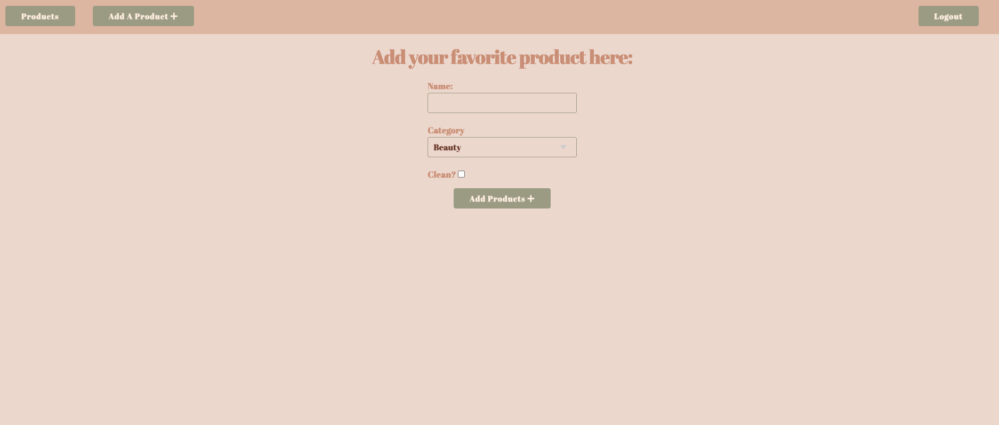
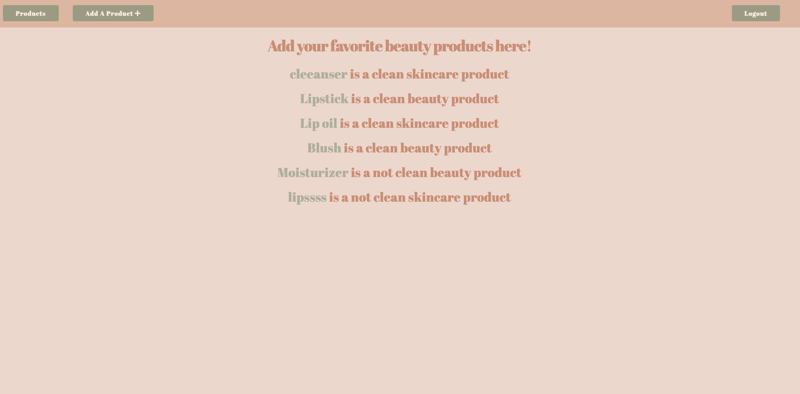
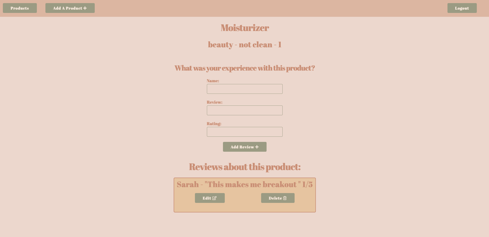
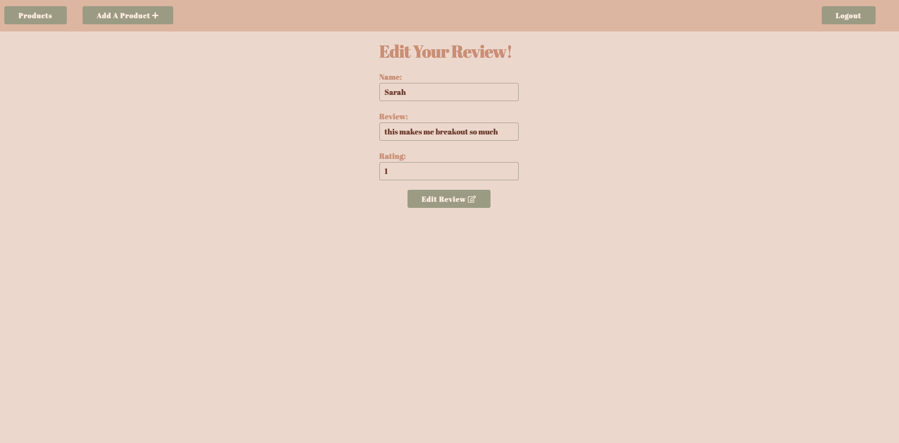

SJBeauty 

As someone who has sensitive skin, I am always on the hunt for clean skincare and beauty products. When I first started realizing the way my skin would react to certain products, I started doing my own research as to what actually goes into into those products that would warrant such crazy reactions. Unfortunately, I found that the FDA allows chemicals that are known to cause harm such like cancer - that includes parabens, phalates, formaldehyde - these are all ingrediants that may not only cause unwanted reactions to your skin but they can also harm your health. That said, there are incredible companies out there that are 100% free of these ingredients (if you're interested in researching more about strict health standards and clean products, I recommed the EWG Verified app. The Environmental Working Group is a nonprofit, nonpartisan organization dedicated to helping you live your healthiest life [ewg](https://www.ewg.org/apps/)). My app allows the user to add a product they are using at the moment and leave a review of their choice. Is the product they're currently using clean? What were their reactions like? Did they find something in the ingredients that they feel others should know about? What do they rate the product overall? All this can be done in my application. However if the user changes their mind and would like to edit or delete their review, that can only be done on the users profile and are not authorized to delete or edit anyone elses reviews. 

App Link:
- [sjbeauty](https://sj-beauty-reviews.herokuapp.com/)
  
Trello Board:
- [trello](https://trello.com/b/S3T3ztEl/sjbeauty)

Trello Images:

App Images:

Credit: Stock Photo 
- [Pixabay](https://pixabay.com/photos/toner-skin-skincare-cooling-facial-906142/)

Technologies and sites used:
- Javascript
- HTML
- CSS
- MongoDB
- Express
- Mongoose
- Google Oauth
- Google Fonts
- Milligram - CSS Framework
- Font Awesome
- Pixabay

Next Steps:
- Option to delete products
- Add product images
- Purchase clean products from the site 
- Upload personal images to my profile

